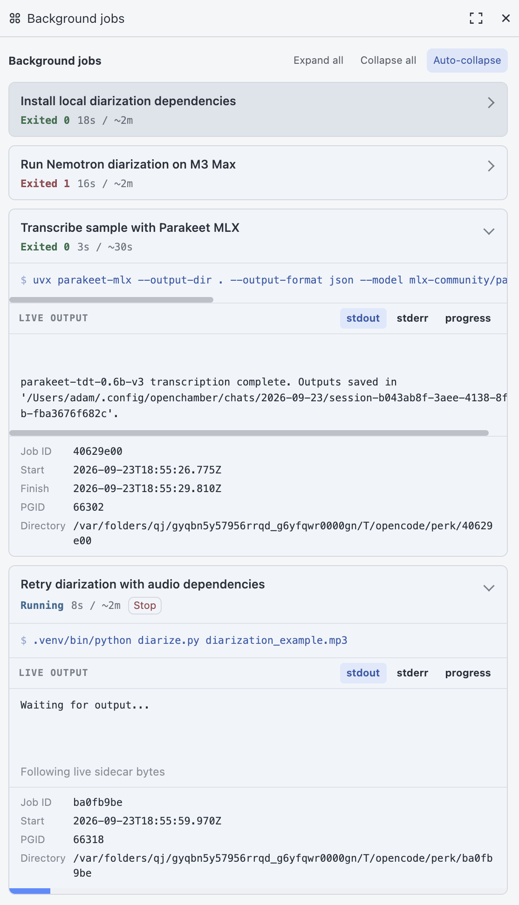

# perk

[](https://www.npmjs.com/package/opencode-perk)
[](https://github.com/rndmcnlly/opencode-perk/actions/workflows/publish.yml)
[](https://www.npmjs.com/package/opencode-perk)

*Background jobs for OpenCode agents that report back when they finish, or
when they make important progress along the way.*

When a coding agent runs a long build, a test suite, or a training run, it
normally sits in a blocking shell call and you sit there with it. perk gives
the agent a `bash_background` tool instead. The agent starts the command, ends
its turn, and the conversation is yours again. When the job finishes, a new
message lands in the conversation with the exit code and how much output it
produced, and the agent picks up from there. A job that is still running can
also send updates when it has something worth saying.

Most agent turns don't involve a long wait, but the few that do can take a
very long time. Getting the conversation back during that wait is partly about
time, and partly about what you can do with it. You can ask why the job is
worth waiting for, whether it could be done differently or faster, or talk
about something else while it cooks. Sometimes that side conversation shows
the job should be cancelled.

## Where this stands: OpenCode V1 and V2

Background shell jobs were a critical missing feature in OpenCode V1, and perk
filled that gap as a plugin. OpenCode V2 made them a core feature, including
the return path: a finished job notifies the conversation on its own. perk
does not run on V2 at all, because V2's plugin architecture is incompatible
with V1 plugins.

The narrow thing V2 still lacks is incremental updates from a job that is
still running (perk's `$PERK_DRIP`, described below). For V2, that piece
lives in [opencode-monitor](https://github.com/rndmcnlly/opencode-monitor), a
small plugin that adds a
`monitor: true` flag to V2's native background shell, so each line the command
prints arrives in the conversation while it runs. perk remains a working V1
plugin, verified against OpenCode 1.18.3.

## Where it came from

With my Computational Media MS student Ivan Martinez-Arias, I built
[Live Coaches](https://escholarship.org/uc/item/2pb8x2jg): AI assistants that
help players while they play, aware of what is happening in the game right
now. Our custom harness fed incremental updates from the game into the
assistant's conversation as they happened, so the assistant could respond to
the world without waiting for the player to describe it. A few months later I
wanted the same capability in my everyday coding agent, in a general form where
any shell command could produce the next turn.

perk is that generalization. Claude Code had shipped a similar
[Monitor tool](https://code.claude.com/docs/en/whats-new/2026-w15) in April
2026, which I only learned about later. Two independent designs landing in the
same place suggests this is a feature harnesses need.

## What it does for you

### Keep talking while a job runs

```
bash_background({ command: "make build" })
```

The call returns immediately. stdout, stderr, and the exit code are captured to
files in a private temp directory, and the tool tells the agent where they
are. When the build exits, the agent gets a message like
`Job 3fa18c2e exited 2: out 0 bytes, err 1843 bytes` and reads the output only
if something is worth reading. stderr contents are never pasted into the
conversation automatically.

`workdir` defaults to the session directory, as with the built-in `bash`.
`timeout` defaults to one hour (the built-in `bash` stops at two minutes),
after which perk stops the job and reports a timeout. `label` and
`expected_ms` are optional hints for display.

### Wait for anything you can express in shell

Because a job is just a command, "tell me when X happens" is a command that
exits when X happens:

```
bash_background({ command: "until [ -e results.csv ]; do sleep 1; done" })
```

A file appearing, a port opening, a lock releasing, a remote job finishing:
anything you can wait on in a shell loop can wake the agent.

### Get progress updates from a running job

Every job has `$PERK_DRIP` set to a file. Anything appended to it arrives in
the conversation as its own message, while the job is still running:

```
bash_background({ command: '
  for page in 1 2 3; do
    build_page "$page"
    echo "built page $page" >> "$PERK_DRIP"
    sleep 2
  done
' })
```

The agent sees `Spike from job 3fa18c2e: built page 1`, then page 2, then
page 3, then the usual exit message. Writes that land close together are
grouped into one message, and a pause of more than a second separates
messages. Pass `coalesce_ms` to change that interval (minimum 300 ms). Jobs
that never touch `$PERK_DRIP` just report once, at the end.

### Stop a job

The tool returns the job's process-group id. `kill -TERM -<pgid>` (note the
minus) stops the command and everything it started, and the agent gets a
cancellation message. This makes long-lived jobs like dev servers safe to
start:

```
bash_background({ command: "npm run dev", timeout: 14400000 })
```

Running jobs are also stopped when OpenCode shuts down normally. If OpenCode
crashes or is killed with `kill -9`, use the pgid to clean up by hand.

### Headless runs

The return message depends on a live session to deliver it. In an interactive
session, the agent should just end its turn. Under `opencode run`, ending the
turn ends the process, so the agent should wait in the foreground on the exit
file the tool returned:

```bash
until [ -e <exit-file> ]; do sleep 0.3; done
```

The exit file appears only after the job has finished (or been stopped) and
its output is flushed.

## Install

Add perk to the `plugin` array in your `opencode.json` (project or global):

```json
{
  "$schema": "https://opencode.ai/config.json",
  "plugin": ["opencode-perk@latest"]
}
```

OpenCode installs it at startup and `bash_background` becomes available to the
model.

Some OpenCode releases keep an older cached copy even with `@latest`. To pick
up a new release, quit OpenCode, delete perk's cache entry, and restart:

```bash
rm -rf "${XDG_CACHE_HOME:-$HOME/.cache}/opencode/packages/opencode-perk@latest"
```

(From this checkout, `npm run refresh:opencode` does the same.)

To skip the config entry, drop the single-file bundle into a plugin directory,
where OpenCode finds it automatically:

```bash
mkdir -p .opencode/plugin
curl -o .opencode/plugin/perk.js \
  https://unpkg.com/opencode-perk@latest/dist/perk.js
```

Use `~/.config/opencode/plugin/` instead for a global install.

## The OpenChamber panel

If you use [OpenChamber](https://github.com/openchamber/openchamber), the
optional [background-jobs panel](./openchamber-extension/README.md) shows each
job as a card with its status, elapsed time, live output, and a stop button.
Here several audio-processing jobs run side by side while the conversation
stays free:

<a href="./assets/openchamber-background-jobs.png"></a>

Messages from perk arrive with the `user` role, since that is how OpenCode
injects a turn. Each one carries `metadata.source: "opencode-perk"` on its text
part, so a client can tell them apart from messages a person typed and display
them differently.

## For harness authors

Nothing here is conceptually specific to OpenCode. You need two things: a way to inject a
turn into a live session, and something that watches for a job to finish. perk
uses OpenCode's `session.promptAsync` and a loop that polls for each job's exit
file. If your harness can do the first, you can build the rest.

## Files and logs

Each job gets a private directory under `os.tmpdir()/opencode/perk/` holding
its launch record, `out`, `err`, `drip`, and `exit` files. Nothing is written
into your project, and finished job directories are deleted after 24 hours.
Logging is off by default. Set `PERK_LOG=1` before starting OpenCode to log to
the spool's `log` file, or set it to a path.

## Develop and test

To run your working copy in sessions started in this repo:

```bash
npm install
mkdir -p .opencode/plugin
ln -s ../../src/index.ts .opencode/plugin/perk.ts
```

Edits take effect the next time OpenCode starts here. Sessions elsewhere keep
using the npm version. Remove `.opencode/` to stop.

`npm test` runs the unit and process tests. `npm run check` also builds the npm
modules and the single-file bundle first. [`TESTING.md`](./TESTING.md) is a
live test written for a perk-enabled agent to run on itself: it fires jobs,
goes idle, and checks that it gets woken.

## Name

The agent perks up, like ears lifting at a sound from outside.

## License

[MIT](./LICENSE).
